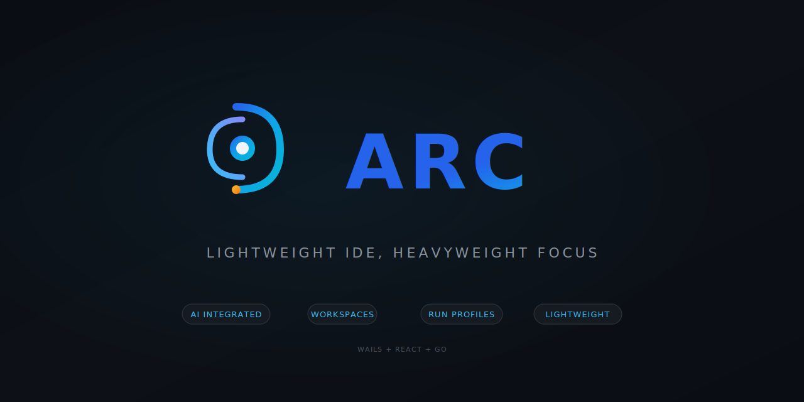

# Arc IDE

<p align="center">
  
</p>

<p align="center">
  <strong>A lightweight, workspace-focused desktop IDE built with Go and React.</strong>
</p>

<p align="center">
  
  
  
</p>

<p align="center">
  
  
  
  
</p>

---

## Why Arc?

Modern monorepos contain frontend (React/TypeScript), backend services (Python, Go), and infrastructure code. Traditional IDEs either:

- **Load everything at once** — consuming 4-8GB+ RAM with all language servers running
- **Require separate windows** — losing context when switching between frontend and backend

**Arc takes a different approach:** One repo, multiple focused workspaces.

Each workspace has independent layout state, scoped language servers (only the active workspace runs LSP), and workspace-specific Run Profiles. Switching workspaces is instant—like changing perspectives, not opening a new app.

## Key Design Decisions

### Wails over Electron

Arc uses [Wails](https://wails.io) (Go backend + system WebView) instead of Electron:

| Aspect | Electron | Wails |
|--------|----------|-------|
| Binary size | ~150MB+ | ~15MB |
| RAM baseline | ~300MB+ | ~50-100MB |
| Startup | 2-5 seconds | <1 second |
| Bundled runtime | Chromium + Node.js | System WebView |

The trade-off: Fewer npm packages that rely on Node.js APIs work out-of-the-box. Worth it for a lightweight, fast IDE.

### AI Integration

Built-in AI assistant panel with:
- Context-aware code assistance (current file, selection, workspace)
- Multiple provider support (Claude, OpenAI, local Ollama)
- Diff preview before applying suggested changes
- Multi-panel broadcast mode for comparing AI responses

## Architecture

```
┌─────────────────────────────────────────────────────────────────┐
│                        Wails Runtime                            │
├─────────────────────────────────────────────────────────────────┤
│                                                                 │
│  ┌─────────────────┐              ┌─────────────────────────┐  │
│  │   Go Backend    │◄────────────►│    React Frontend       │  │
│  │                 │   bindings   │                         │  │
│  │  • File System  │              │  • CodeMirror 6 Editor  │  │
│  │  • FS Watcher   │              │  • Zustand State        │  │
│  │  • LSP Client   │              │  • Panel System         │  │
│  │  • Run Profiles │              │  • Theme Engine         │  │
│  │  • Git Ops      │              │                         │  │
│  └─────────────────┘              └─────────────────────────┘  │
│                                                                 │
└─────────────────────────────────────────────────────────────────┘
```

| Component | Technology |
|-----------|------------|
| Backend | Go 1.21+ (layered package structure) |
| Frontend | React 18 + Vite + TypeScript |
| State | Zustand |
| Editor | CodeMirror 6 |
| File Watching | fsnotify with debounce |
| Language Intelligence | LSP per workspace (planned) |
| Search | ripgrep (planned) |

### Performance Targets

- **Cold start:** < 2 seconds
- **Idle CPU:** near 0% (event-driven, no polling)
- **Core RAM:** ~200-450MB (without language servers)
- **Workspace switch:** Instant (0ms perceived delay)

## Current Implementation

### Completed

**Backend (Go)**
- [x] Layered package structure (domain → application → infrastructure → interfaces)
- [x] `ReadDirectory` — recursive directory listing with file metadata
- [x] `ReadFile` — content reading with automatic encoding detection (UTF-8, UTF-16, Latin-1)
- [x] `WriteFile` — content writing with encoding preservation
- [x] File system watcher — real-time external change detection with debounced events

**Frontend (React/TypeScript)**
- [x] CodeMirror 6 editor with Deep Ocean theme
- [x] Syntax highlighting (JS, TS, Python, Go, CSS, HTML, JSON, Markdown)
- [x] Tab-based editing with modified indicators
- [x] JetBrains-style autosave (debounced idle + focus loss)
- [x] File explorer with tree navigation
- [x] Workspace accent color system (7 theme variants)
- [x] Panel layout system with drag-to-resize and collapse/expand
- [x] Icon system with currentColor SVGs
- [x] Status bar (cursor position, language, git branch)

### Planned

- [ ] Terminal emulation (xterm.js + PTY)
- [ ] Workspace management (open folder, persistence, recent projects)
- [ ] Run profile execution
- [ ] LSP client integration
- [ ] Git integration
- [ ] Search with ripgrep
- [ ] AI Chat Panel

## Project Structure

```
arc-ide/
├── main.go                     # Application entry
├── app.go                      # Wails bindings
├── internal/
│   ├── filesystem/             # File read/write/watch
│   ├── watcher/                # FS event watcher
│   └── process/                # Process management
├── frontend/
│   ├── src/
│   │   ├── components/         # React components
│   │   ├── stores/             # Zustand state
│   │   └── assets/             # Icons, logos
│   └── wailsjs/                # Generated Go bindings
└── docs/
    ├── ROADMAP.md              # Consolidated roadmap with all issues
    ├── design-specification.md # Full UI/UX specification
    ├── ARCHITECTURE.md         # System architecture guide
    └── tdd/                    # Technical design documents
```

## Development

### Prerequisites

- Go 1.21+
- Node.js 18+
- Wails CLI: `go install github.com/wailsapp/wails/v2/cmd/wails@latest`

### Commands

```bash
# Live development with hot reload
wails dev

# Production build
wails build

# Run frontend tests
cd frontend && npm test

# Run Go tests
go test ./...
```

## Design Documentation

The [Design Specification](docs/design-specification.md) contains the complete UI/UX blueprint:

- Visual identity and theme tokens
- Workspace model and multi-workspace editing
- Run Profiles system
- AI Chat Panel design
- Keyboard shortcuts

See the [Roadmap](docs/ROADMAP.md) for implementation progress and all tracked issues.

## Contributing

This project follows a ticket-based workflow:

1. Issues tracked via GitHub Issues
2. Feature branches created from `develop`
3. Test-driven development required
4. PRs merged to `develop` after review
5. `main` reserved for releases

## License

MIT
