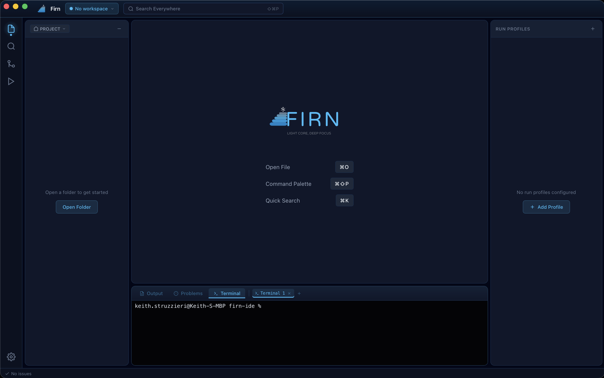

<p align="center">
  
</p>

<p align="center">
  
  
  
</p>

<p align="center">
  
  
  
  
</p>

---

## Why Firn?

Modern monorepos contain frontend (React/TypeScript), backend services (Python, Go), and infrastructure code. Traditional IDEs either:

- **Load everything at once** — consuming 4-8GB+ RAM with all language servers running
- **Require separate windows** — losing context when switching between frontend and backend

**Firn takes a different approach:** One repo, multiple focused workspaces.

Each workspace has independent layout state, scoped language servers (only the active workspace runs LSP), and workspace-specific Run Profiles. Switching workspaces is instant—like changing perspectives, not opening a new app.

## Key Design Decisions

### Wails over Electron

Firn uses [Wails](https://wails.io) (Go backend + system WebView) instead of Electron:

| Aspect | Electron | Wails |
|--------|----------|-------|
| Binary size | ~150MB+ | ~15MB |
| RAM baseline | ~300MB+ | ~50-100MB |
| Startup | 2-5 seconds | <1 second |
| Bundled runtime | Chromium + Node.js | System WebView |

The trade-off: Fewer npm packages that rely on Node.js APIs work out-of-the-box. Worth it for a lightweight, fast IDE.

### Future AI Integration

The roadmap includes a built-in AI assistant panel with:
- Context-aware code assistance (current file, selection, workspace)
- Multiple provider support (Claude, OpenAI, local Ollama)
- Diff preview before applying suggested changes
- Multi-panel broadcast mode for comparing AI responses

## Architecture

```
┌─────────────────────────────────────────────────────────────────┐
│                        Wails Runtime                            │
├─────────────────────────────────────────────────────────────────┤
│                                                                 │
│  ┌─────────────────┐              ┌─────────────────────────┐  │
│  │   Go Backend    │◄────────────►│    React Frontend       │  │
│  │                 │   bindings   │                         │  │
│  │  • File System  │              │  • CodeMirror 6 Editor  │  │
│  │  • FS Watcher   │              │  • Zustand State        │  │
│  │  • Run Profiles │              │  • Run Profile Cards    │  │
│  │  • PTY Terminal │              │  • Panel System         │  │
│  │  • Workspace    │              │  • Run Output Views     │  │
│  │  • LSP Client   │              │  • LSP Editor UX        │  │
│  │  • ripgrep      │              │  • Search UI            │  │
│  └─────────────────┘              └─────────────────────────┘  │
│                                                                 │
└─────────────────────────────────────────────────────────────────┘
```

| Component | Technology |
|-----------|------------|
| Backend | Go 1.23+ (layered package structure) |
| Frontend | React 19 + Vite + TypeScript |
| State | Zustand |
| Editor | CodeMirror 6 |
| File Watching | fsnotify with debounce |
| Language Intelligence | LSP per active workspace |
| Search | ripgrep workspace search + CodeMirror in-file search |

### Performance Targets

- **Cold start:** < 2 seconds
- **Idle CPU:** near 0% (event-driven, no polling)
- **Core RAM:** ~200-450MB (without language servers)
- **Workspace switch:** Instant (0ms perceived delay)

## Current Implementation

### Completed

**Backend (Go)**
- [x] Layered package structure (domain, application, infrastructure, interfaces)
- [x] `ReadDirectory` — recursive directory listing with file metadata
- [x] `ReadFile` — content reading with automatic encoding detection (UTF-8, UTF-16, Latin-1)
- [x] `WriteFile` — content writing with encoding preservation
- [x] File system watcher — real-time external change detection with debounced events
- [x] Workspace store — open folder, persistence, recent projects
- [x] LSP client foundation — JSON-RPC framing, stdio transport, lifecycle, crash recovery, diagnostics/status events
- [x] Search backend — ripgrep JSON parsing, cancellation, typed errors, and result caps

**Run Profiles (Go + React)**
- [x] Auto-detection from package.json, go.mod, Makefile, pyproject.toml, docker-compose
- [x] Process executor with lifecycle management (start, stop, restart, SIGTERM grace period)
- [x] Real-time output streaming with line assembly and FIFO truncation
- [x] Pin/unpin profiles (promote detected to saved, demote back)
- [x] Run history tracking (last 50 runs per profile with pass/fail/duration)
- [x] Waveform activity visualization (output rate per 500ms interval)
- [x] Status badges (RUNNING, PASSED, FAILED, READY, STOPPING, STOPPED)
- [x] Auto-expand cards for active states, auto-collapse on completion
- [x] Purpose-built expanded panels per state (activity graph, output preview, stats, error detail, SIGTERM progress)
- [x] Predicted completion ETA with median-based estimation and running card sort
- [x] Failed-state attention pulse animation
- [x] Profile browser for hidden profile management
- [x] Reactive re-detection on config file changes via file watcher

**Frontend (React/TypeScript)**
- [x] CodeMirror 6 editor with Firn Glacier theme
- [x] Syntax highlighting (JS, TS, Python, Go, CSS, HTML, JSON, Markdown)
- [x] Tab-based editing with modified indicators
- [x] JetBrains-style autosave (debounced idle + focus loss)
- [x] File explorer with tree navigation
- [x] Workspace accent color system (7 theme variants)
- [x] Panel layout system with drag-to-resize and collapse/expand
- [x] Icon system with currentColor SVGs
- [x] Status bar (cursor position, language, git branch)
- [x] Toast notification system

**Language Intelligence**
- [x] Frontend document sync (`didOpen`, debounced `didChange`, `didSave`, `didClose`)
- [x] TypeScript/JavaScript LSP vertical slice through `typescript-language-server --stdio`
- [x] Diagnostics underlines, gutter markers, Problems panel, and status-bar counts
- [x] Completion source with trigger characters, detail/docs, and snippet support
- [x] Hover tooltips and go-to-definition (`F12`, Cmd/Ctrl-click)
- [x] Shared registry entries for Go (`gopls`) and Python (`pyright-langserver`)

**Search**
- [x] Workspace-wide ripgrep search with regex, case, and whole-word options
- [x] Results grouped by file with highlighted matches and keyboard navigation
- [x] Cmd+Shift+F opens workspace search
- [x] Click result to open the file at the match location
- [x] In-file find/replace through CodeMirror search (`Cmd+F`)

**Terminal Integration**
- [x] PTY backend — shell sessions with bidirectional I/O and ANSI support
- [x] xterm.js frontend — themed terminal with Firn Glacier colors
- [x] Multiple terminal sessions — create, switch, close, rename, drag-to-reorder
- [x] Graceful process termination — SIGHUP via PTY close with SIGKILL fallback

**Run Output Panel**
- [x] Per-profile output display with tab selection
- [x] Multiple view modes (merged, lanes, diff, timeline)
- [x] Auto-scroll with toggle
- [x] Output folding for repeated patterns

### Planned

- [ ] Complete TypeScript project-root detection for nearest `tsconfig.json`, `jsconfig.json`, or `package.json`
- [ ] Git integration
- [ ] Run output clickable `file:line:col` links
- [ ] Run Profile environment variants and compound execution
- [ ] Workspace identity and Project/Workspace file tree views
- [ ] AI Chat Panel

## Project Structure

```
firn-ide/
├── main.go                     # Application entry
├── app.go                      # Wails bindings
├── internal/
│   ├── filesystem/             # File read/write/watch
│   ├── lsp/                    # LSP client, registry, transports, URI handling
│   ├── runprofile/             # Run profile detection, execution, management
│   ├── search/                 # ripgrep search runner and parser
│   ├── terminal/               # PTY session management
│   ├── watcher/                # FS event watcher
│   ├── workspace/              # Workspace persistence
│   └── process/                # Process management
├── frontend/
│   ├── src/
│   │   ├── components/         # React components
│   │   │   ├── Editor/         # CodeMirror 6 editor
│   │   │   ├── FileExplorer/   # File tree navigation
│   │   │   ├── RunProfiles/    # Run profile cards and panels
│   │   │   ├── RunOutput/      # Output display (merged, lanes, diff, timeline)
│   │   │   ├── Search/         # Workspace-wide search
│   │   │   ├── Terminal/       # xterm.js terminal
│   │   │   └── layout/         # Panel system, sidebar, header
│   │   ├── stores/             # Zustand state management
│   │   ├── hooks/              # Custom React hooks
│   │   ├── utils/              # Shared utilities
│   │   └── types/              # TypeScript type definitions
│   └── wailsjs/                # Generated Go bindings
└── docs/
    ├── roadmap.md              # Consolidated roadmap with all issues
    ├── design-specification.md # Full UI/UX specification
    └── architecture.md         # System architecture guide
```

## Development

### Prerequisites

- Go 1.23+
- Node.js 18+
- Wails CLI: `go install github.com/wailsapp/wails/v2/cmd/wails@latest`

### Commands

```bash
# Live development with hot reload
wails dev

# Production build
wails build

# Run frontend tests
cd frontend && npm test

# Run Go tests
go test ./...
```

## Design Documentation

The [Design Specification](docs/design-specification.md) contains the complete UI/UX blueprint:

- Visual identity and theme tokens
- Workspace model and multi-workspace editing
- Run Profiles system
- AI Chat Panel design
- Keyboard shortcuts

See the [Roadmap](docs/roadmap.md) for implementation progress and all tracked issues.

## Current Priorities

1. Finish TypeScript project-root detection for the remaining LSP integration work.
2. Add clickable run-output error links.
3. Complete Run Profile environment variants and compound execution.
4. Build workspace identity, active workspace accenting, and Project/Workspace tree views.

## Contributing

This project follows a ticket-based workflow:

1. Issues tracked via GitHub Issues
2. Feature branches created from `develop`
3. Test-driven development required
4. PRs merged to `develop` after review
5. `main` reserved for releases

## License

MIT
